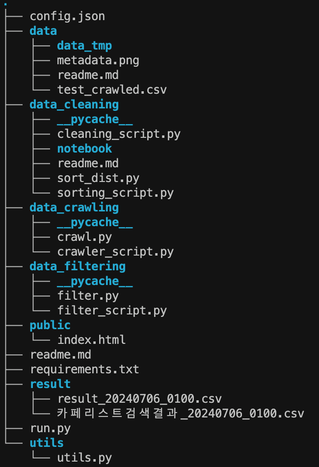
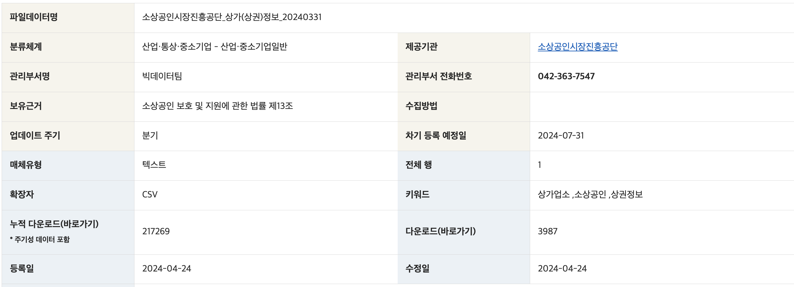

# 카카오 지도를 크롤링하여 목적에 따른 필터링 작업 진행

## 개요

- **개발 목적**: 특정 위치 주변에 열려있는 매장들을 거리가 가까운 순서대로 보여주기 위함
- **개발 기간**: 6/25 ~ 7/5 (10일)
- **환경**
    - 운영체제: Windows 10 / Mac OS 
    - 버전관리: `Git`, `Github`
    - 의존성관리: `Conda`
    - 개발 언어 및 프레임워크
        - `Python 3.12.4`
        - `Padnas 2.2.2`
        - `Requests 2.32.3`
        - `Selenium 4.22.0`
        - `BeautifulSoup4 4.12.3`
        - `py-script 0.2.5`
        - `html`
- **기술**
    - 데이터 분석: `Pandas`
    - 크롤링: `Selenium`
    - 화면 구현: `Kakao Map API`, `html`, `py-script`

- **디렉토리**

 

- `run.py`
    1. `cleaning_script.py`: 원본 데이터 정리, 정리된 csv파일 저장
    2. `crawler_script.py`: 크롤링, 크롤링정보 추가된 csv파일 저장 (운영정보 텍스트 정리 안됨)
    3. `sorting_script.py`: 위경도 기준 전달된 반경 내의 매장을 거리순으로 정렬후 csv파일 저장
    4. `filter_script.py`: 운영정보 텍스트를 정제, 원하는 내용만 뽑아내 준 후, 입력된 시간에 운영하는 매장들만 골라서 반환

## 과정

1. **데이터 수집**
    - 출처: https://www.data.go.kr/data/15083033/fileData.do
    - 소상공인시장진흥공단_상가(상권)정보
    
    
    
    - 업데이트 주기: 분기
    - 마지막 수정일: 2024-04-24
    - encoding: utf-8
    - data size: (475236, 39)
    - memory usage: 141.4+ MB

2. **데이터 정제** (`data_cleaning/`)
    1. 데이터 확인
    2. 불필요한 컬럼 제거: (475236, 39) -> (475145, 10)
        <!--- 상호명
        - 지점명
        - 상권업종소분류명: 업종 선택을 위함 -> 표쥰산업분류명로만 부족 -> 카페
        - 표쥰산업분류명: 업종 선택을 위함 -> 커피 전문점 (+ 결측치 있는 행 제거)
        - 행정동 
        - 법정동
        - 지번주소
        - 도로명주소
        - 경도
        - 위도 -->
    3. 업종 선택(카페): (475145, 10) -> (21425, 10)
        <!-- - 상권업종소분류명 -> 카페
        - 표쥰산업분류명 -> 커피 전문점 -->
    4. 지역 좁히기(기능 구현 우선): 서울(21425, 10) -> 종로1234가동(364, 10)
        <!-- - 행정동명이 종로1234가동 인 경우만 선택 (`py.dong`) -->

3. **크롤링** (`data_crawling/`)
    1. 카카오맵에서 해당 업장 검색한 링크 얻어와서 url 컬럼 추가 <!--(`py.crawling.get_url`)-->
    2. 해당 링크안의 영업시간 정보 크롤링 <!--(`py.crawling.newtab_parse`)-->
    3. 영업시간정보 컬럼 추가

4. **영업시간 텍스트 정보 정제** (`data_filtering/`)
    1. 텍스트 정규화
    2. 영업시간에 맞춰 데이터 선택
    3. 결과 출력
    
5. **스크립트를 통해 검색결과 출력** (`result/`)
    - input: 위도, 경도, 반경, 운영시간
    - output: 기준접으로부터 정해진 거리까지의 카페를 가까운 순으로 정렬하여 출력 
        - out_csv columns : 상호명, 거리, 링크, 주소, 운영시간

6. **kakao map api를 통해 사용자에게 정보 입력받아 스크립트에 전달** (`public/`)